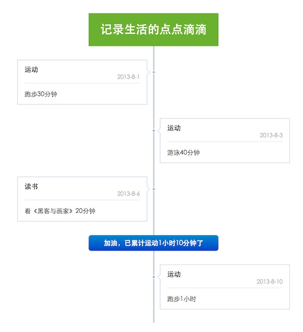

## 综述

Time_line是一个根据给定数据自动生成Time_line布局的高度自定义组件。

* Author: 跑猪

## 快速使用

    S.use('kg/timeline/2.0.0/index', function (S, Time_line) {
         var timeline = new Time_line('#id',data [,opt]);
    })
    

## API说明

Time_line类接受三个参数。例如 `new Time_line('#id',data [,opt])`

### 参数一：容器

第一个参数是组件容器选择符，例如#id，其他方式详见http://docs.kissyui.com/docs/html/api/core/dom/selector.html

### 参数二：数据项说明
第二个参数是一个数组，数组中每项存储一个对象，对象属性说明如下：

属性名 | 类型 | 默认值 | 描述 
------------ | ------------- | ------------ | ------------ 
template | String   | “fb” | 该条数据对应的html模板名
pos | Enum("left","right","center")  | 自动计算(左右交替)  | 该条数据的位置，"left","right","center"
xxx | | |自定义属性
yyy | | |自定义属性
…   | | | 可根据自己条目html模板结构，添加自定义属性

### 参数三：配置项说明

参数名 | 类型 | 默认值 | 描述 
------------ | ------------- | ------------ | ------------ 
html_template | Array | [fb] | 条目html模板
start_pos | Enum("left","right","center")   | "left"  | 首条目的位置
container_width | Number  | 600  |	timeline容器的宽度
line_width | Number | 28  |  中间时间轴的宽度
item_gap_space | Number | 30 | 各条目之间的间距
top_gap_space| Number | 15 | 首条目与容器间距
bottom_gap_space | Number | 15 | 末条目与容器间距

PS：以上宽度、间距单位都为px。

## 模板样式

### 时间线样式

中间的时间线是一个div：`

` ，请根据自己需要，为其添加css样式，例如：

     .tl-line{
     	background:#aabbcc;
     }

如果你想使用组件里默认时间线样式，手动引入“timeline_fb.css”即可。

### 条目模板

组件里带一个默认模板“fb”，其html结构如下。如果需要使用该模板，需要手动引入“timeline_fb.css”

      

        
<h1>{title}</h1><h2>{date}</h2>
"
          

{content}

"
        
"
      <i class='fb-{pos}-pointer'></i>";`
     
PS：模板里{xxx}的内容，与数据项中xxx属性所对应，生成html时，{xxx}会被数据项xxx属性值所替换。

## 使用示例

### 代码
    <!doctype html>
    <html>
    <head>
        <meta charset="utf-8"/>
        <title>timeline的demo</title>
        
        <!-- 引入自带的fb模板 -->
        <link rel="stylesheet" href="./timeline_fb.css">
        <!-- 为自定义模板 定义样式 -->
        
    </head>
    
    <body>
      <h2>Time_line的demo</h2>
      <!-- timeline 容器-->
      

      
    </body>
    </html>

###效果

